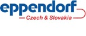

# Central European Meeting on Genome Stability and Dynamics

**Friday, May 13, 2011**

Faculty of Natural Sciences, Comenius University in Bratislava\
Mlynská dolina B-1 / Amos, 842 15 Bratislava 4, Slovakia

[Photo gallery](TODO)

## **Program**

* **8.30 - 9.15:** Arrival, Registration & Morning Coffee
* **9.15 - 9.20:** **Welcome & Opening** – Miroslav Chovanec
* **9.20 - 10.45: Session I** (Chair: Peter Schlögelhofer)
  * **9.20 - 9.45:** Petar T. Mitrikeski – *Zpiga's sight: Genome sustainability – lessons from recombination*
  * **9.45 - 10.10:** Cornelia Rumpf – *Psz1/Mde4 complex is required to prevent merotelic kinetochore attachments*
  * **10.10 - 10.45:** Franz Klein – *Fatal ties – the essential role of the Smc5/6 complex in meiotic recombination*
* **10.45 - 11.15:** **Coffee Break**
* **11.15 - 12.45: Session II** (Chair: Miroslav Chovanec)
  * **11.15 - 11.35:** Mona von Harder – *Meiotic DNA repair in plants: The AtHOP2/AHP2 protein and its role in supporting AtRAD51 and AtDMC1*
  * **11.35 - 11.45:** Mihaly Kovacs – *Overview of group activities*
  * **11.45 - 12.05:** Kata Sarlos – *Temperature-dependent switch in the mechanochemical activity of RecQ helicases*
  * **12.05 - 12.25:** Mate Gyimesi – *Basic homologous recombination activities can be performed by the minimal core of Bloom's syndrome helicase*
  * **12.25 - 12.45:** Sona Hubackova – *PML colocalizes with persistent DNA damage lesions in senescent cells*

* **13.00 - 14.00:** **Lunch**
* **14.00 - 15.50: Session III** (Chair: Jozef Nosek)
  * **14.00 - 14.20:** Karel Riha – *How much telomeric DNA do we need for chromosome protection?*
  * **14.20 - 14.35:** Juraj Kramara – *Yarrowia lipolytica: A new model for telomere biology*
  * **14.35 - 14.50:** Dominika Fricova – *Linear mitochondrial genomes in yeasts: A paradigm for evolution of linear chromosomes and their telomeric structures*
  * **14.50 - 15.05:** Richard Kollar – *Mathematical model of alternative mechanism of telomere length maintenance*
  * **15.05 - 15.20:** Vladimir Pevala – *DNA-binding properties of yeast mitochondrial protein Mgm101*
  * **15.20 - 15.35:** Miroslav Chovanec – *Psoralen-independent interstrand cross-link repair requires a novel complex containing Mph1, Mgm101 and MutS factors*
  * **15.35 - 15.50:** Dominika Maniková – *Toxicity of selenium towards Saccharomyces cerevisiae: a role for recombinational and postreplication repair pathways*
* **15.50 - 16.15:** **Coffee Break**
* **16.15 - 17.45: Session IV** (Chair: Lubomir Tomaska)
  * **16.15 - 16.30:** Jaroslav Kozak – *Rapid repair of DNA double-strand breaks in plants*
  * **16.30 - 16.45:** Mario Spirek – *Towards rapid kinetics of human recombinational machinery*
  * **16.45 - 17.00:** Marek Sebesta – *SUMO-PCNA mediates novel role of Srs2*
  * **17.00 - 17.15:** Peter Kolesar – *Srs2 SUMOylation*
  * **17.15 - 17.30:** David Balogh – *Characterization of the human PCNA ubiquitylation*
  * **17.30 - 17.45:** Szilvia Juhasz – *Measuring the frequency of homologous recombination and random integration in human cells*

* **17.45 - 18.00:** **Closing remarks** – Karel Riha
* **18.15 - onwards:** **Beer at local pub**

## **Organizers**

* **Miroslav Chovanec** (<miroslav.chovanec@savba.sk>)\
  Cancer Research Institute, Slovak Academy of Sciences, Bratislava, Slovakia
* **Lubomir Tomaska** (<tomaska@fns.uniba.sk>)\
  Department of Genetics, Faculty of Natural Sciences, Comenius University in Bratislava, Slovakia
* **Martina Nebohacova** (<nebohacova@fns.uniba.sk>) & **Jozef Nosek** (<nosek@fns.uniba.sk>)\
  Department of Biochemistry, Faculty of Natural Sciences, Comenius University in Bratislava, Slovakia

---

**The meeting is supported by:**
[Bratislava Biocenter](http://www.biocenter.sk/) | [Cancer Research Institute](http://www.exon.sav.sk/) | [Comenius University](http://www.fns.uniba.sk/) | [NATURA o.z.](/)

[How to reach us (click on the link)](./how-to-reach-us/) |
[Accomodation (click on the link)](./accomodation/)
